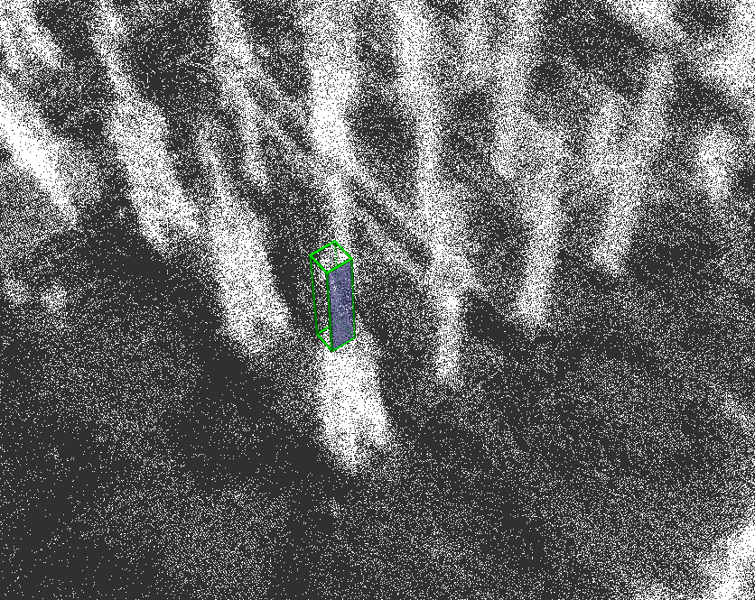

**Usage:**

To publish the green 3D bounding box for an Electrical Component with ID "voltr_2c" (coords must be included in the .yaml file), use:

```
rostopic pub /ipto_id_bbox std_msgs/String voltr_2c
```

The following command additionally publishes a transparent light blue 3D plane that represents a specific face:
```
rostopic pub /ipto_id_bbox std_msgs/String voltr_2c_F2
```

